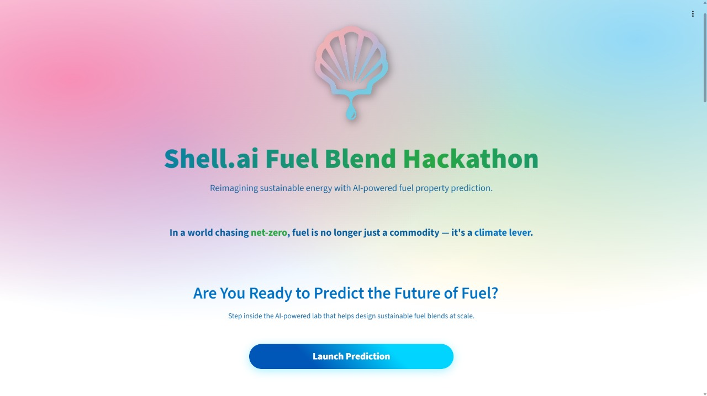
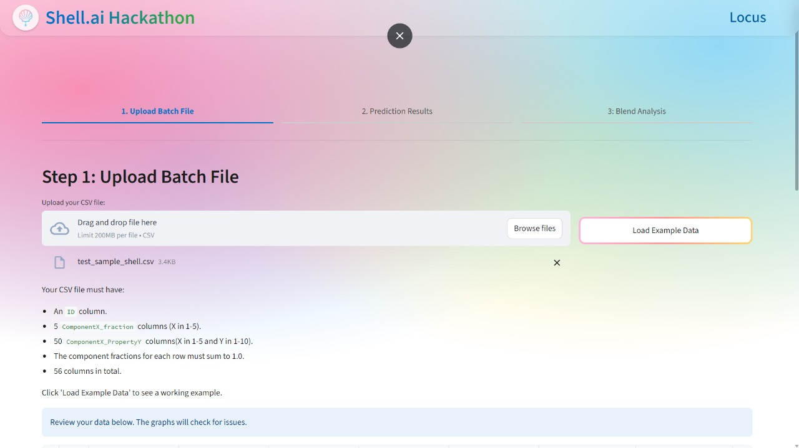
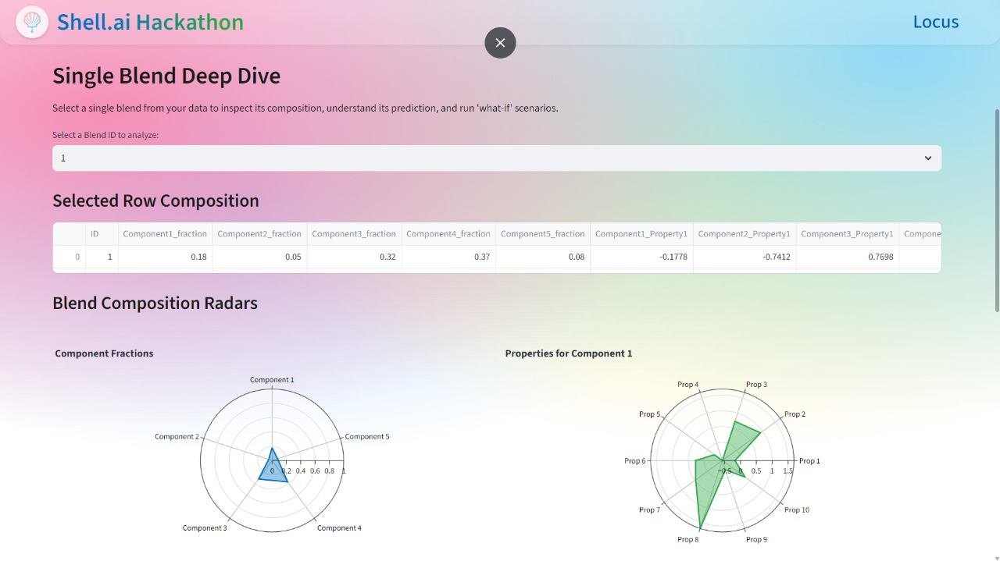

# Shell.ai Hackathon 2025 – Fuel Blend Properties Prediction

Welcome to our solution for the **Shell.ai Hackathon for Sustainable and Affordable Energy 2025**. This repository contains an end-to-end system for predicting and optimizing properties of sustainable fuel blends using advanced machine learning and explainable AI.

---

## Project Overview

The goal is to develop robust AI models that can:
- Predict final blend properties of complex fuels from their component fractions and properties.
- Enable inverse design: suggesting optimal blend compositions for user-specified property targets.
- Provide transparent, interpretable insights through advanced explainability tools.

---

## 📁 Directory Structure
```bash
.
├── .devcontainer/              # Dev container configuration
├── .streamlit/                 # Streamlit app configuration
├── .vscode/                    # IDE settings for Python compatibility
├── catboost_info/              # CatBoost model artifacts/info
├── datasets/                   # Dataset files (train/test/sample_submission)
    ├── corrupted.csv          
    ├── sample_submission.csv
    ├── test.csv
    ├── train.csv
├── images/                     # Project-related images and visualizations
├── models/                     # Trained model weights
├── output/                     # Round 1 Prediction Output
├── feature_engineering.py      # Feature engineering logic
├── model_training.py           # Round 1 Prediction Model Code
├── nn_model.py                 # Neural network ensemble implementation
├── predict_blend_properties.py # Batch prediction script
├── streamlit_app_v2.py         # Interactive Streamlit dashboard
├── requirements.txt            # Python dependencies
└── EXPLANATION.md              # Methodology and technical documentation

```

---
## Getting Started

1. **Clone the repository**

```bash
git clone https://github.com/Shivang0105/fuel_blend_prediction.git
cd fuel_blend_prediction
```


2. **Install dependencies**
```bash
pip install -r requirements.txt
```

---

## 🛠️ Usage

- **Batch Prediction:**  
Run property predictions using `predict_blend_properties.py` with your blend data.

- **Interactive Dashboard:**  
Launch

```bash
streamlit run streamlit_app_v2.py
```

Upload your blend input file, analyze global/local explainability, and try Inverse Blend Design for custom property targets.

---

## Screenshots

<p float="left">
  
  
  
</p>

---

## Key Features

- **Easy Batch File Upload:** Seamlessly upload blend data in **CSV format** for quick batch predictions.

- **Automatic Data Validation:** Instantly highlights **missing values** and checks if **component fractions sum to 1**, ensuring your data is ready for analysis.

- **Interactive Prediction Table:** View, filter, and sort all prediction results for each blend and property directly in your browser.

- **Single Blend Deep Dive:** Select any blend to explore its **complete composition**, **SHAP-based feature explanations**, and **impact visualizations**.

- **Overall Dataset Analysis:** Visualize the distribution of component fractions and predicted properties with **interactive box plots and charts**.

- **Property Sensitivity Analysis:** Instantly see how tweaking any single component’s fraction affects all predicted blend properties.

- **Inverse Blend Design:** Set your desired blend property targets and let the app suggest **optimal blend recipes**.

- **Downloadable Results:** Easily export your predictions and analysis as **CSV files** for further work or reporting.

- **Modern, Intuitive UI:** Fast, responsive, and visually-rich dashboard built using **Streamlit** for an effortless user experience.


---

## 🧑‍💻 Team

A multidisciplinary team passionate about ML, AI, and sustainable energy solutions.
- **Abhinav Tyagi** (ML Engineer)
- **Shivang Sharma** (ML Engineer)
- **Siddharth Mohan Bansal** (Data Scientist)
- **Utkarsh Singh** (DevOps Engineer)

---

## 📄 Documentation

For a deep dive into methodology, model architecture, and analysis, see [`Functioning of the Prototype`](https://drive.google.com/file/d/18g6DD1doUtHTk9UmT8ADm5UbZ_TmgILv/view?usp=sharing).

---

## 🤝 Contributing

We welcome improvements and feedback!  
Feel free to fork, open pull requests, or raise issues.

---

## 📝 License

This project is open-sourced under the MIT License.

---

*Built for the Shell.ai Hackathon for Sustainable and Affordable Energy 2025.*
